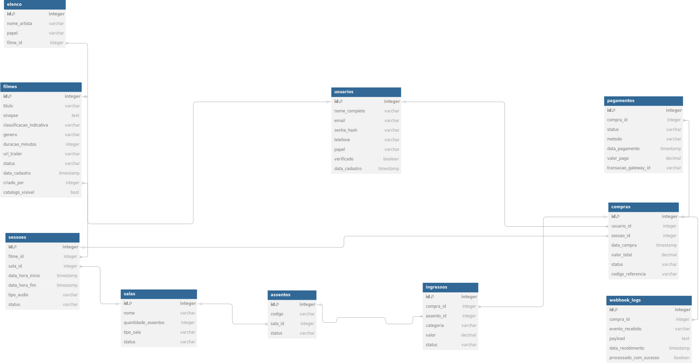

# 🎬 Sistema de Gestão para Cinema – Backend

## 📌 Resumo do Projeto

Este projeto é um sistema completo de backend para a gestão de um cinema, cobrindo tanto a experiência do cliente quanto as operações administrativas. O foco está na criação de um backend robusto, seguro e escalável, responsável por gerenciar cadastro de filmes, sessões, salas, assentos, vendas de ingressos, pagamentos e validações.

A solução contempla controle de acesso por papéis (cliente, operador, financeiro, administrador), fluxo de reservas de assentos com proteção contra concorrência, integração com gateways de pagamento e dashboards administrativos para acompanhamento de vendas. O sistema foi modelado com base em requisitos simulados a partir de entrevistas com especialistas do domínio.

---

## ✅ Requisitos Funcionais

### 🎟️ Visão do Usuário Final

**RF01.** O site deverá mostrar filmes com sessões ativas para visitantes.  
**RF02.** Visitantes podem navegar no site e ver filmes, sessões e detalhes.  
**RF03.** Visitantes podem acessar as redes sociais do cinema.  
**RF04.** Cada filme apresenta: nome, fotos, trailer, sinopse, classificação, gênero, elenco, etc.  
**RF05.** Visitantes podem visualizar as sessões disponíveis para um filme.  
**RF06.** As sessões podem ser dubladas ou legendadas, em salas comuns ou 3D, e possuem horário de início e fim.  
**RF07.** Visitantes podem escolher 1 ou mais assentos em uma sessão, desde que estejam disponíveis.  
**RF08.** Assentos são representados por códigos alfanuméricos (ex: A1, B2).  
**RF09.** Visitantes devem informar a categoria de cada ingresso (meia, inteira, cortesia, etc.).  
**RF10.** Para finalizar a reserva, o visitante deve se logar ou criar uma conta.  
**RF11.** Contas novas devem passar por validação (e-mail ou SMS) para evitar fraudes.  
**RF12.** O sistema direciona o usuário logado para pagamento em plataforma de terceiros.  
**RF13.** O usuário recebe notificações sobre o status da compra (recebida, paga, erro, estornada).  
**RF14.** Usuários logados podem consultar suas compras, com detalhes.  
**RF15.** Um ingresso, após validado na entrada, não pode ser reutilizado.

---

### 🧑‍💼 Visão Administrativa

**RF16.** O sistema deve permitir a criação da primeira conta com perfil `ADMIN`.  
**RF17.** O administrador pode gerenciar usuários, permissões, filmes, sessões, etc.  
**RF18.** Administradores podem promover operadores e delegar funções administrativas temporariamente.  
**RF19.** Operadores podem cadastrar e editar: filmes, sessões, salas, elenco e gêneros.  
**RF20.** Operadores podem visualizar vendas, mas não realizar ações financeiras.  
**RF21.** Usuários com papel `FINANCEIRO` podem realizar estornos, cancelamentos e ver o dashboard.  
**RF22.** O dashboard apresenta:  
 - Gráfico de vendas por filme  
 - Filme mais vendido no dia e no mês  
 - Quantidade e valor dos ingressos vendidos por categoria

---

## ❓ Bloco de Perguntas Técnicas (Refinamento de Requisitos)

### 🧩 Modelagem e Regras de Negócio
- O que define uma sessão como “ativa”? Sessões futuras? Sessões iniciadas mas não encerradas?
- Um assento pertence à sala ou à sessão? Ou ambas?
- Um filme pode ter múltiplos trailers e imagens?
- Como deve funcionar a expiração de reservas não pagas? TTL via Redis?
- Categorias de ingresso são configuráveis? Existem regras para controle de meias?
- É permitido comprar ingressos de categorias diferentes em uma única compra?

### 🔐 Acesso e Segurança
- Qual o fluxo de criação da primeira conta `ADMIN`? Deve ser manual ou controlado via ambiente?
- O sistema precisa suportar login por rede social?
- A verificação de conta via e-mail ou SMS bloqueia a compra até a confirmação?

### 💳 Pagamentos
- Qual gateway de pagamento será utilizado?
- O sistema recebe notificações por webhook? Como garantir idempotência?
- Em qual ponto um ingresso é oficialmente liberado (pagamento confirmado via callback?)?

### 🧾 Compras e Ingressos
- O ingresso é validado via QR code, código alfanumérico ou outro meio?
- O histórico de compras deve mostrar status detalhado do pagamento?
- Como marcar um ingresso como usado? Precisa ser auditado (data, operador)?

### 📊 Administração e Financeiro
- Operadores podem excluir filmes/sessões? O que fazer se já houver vendas?
- Quais filtros e períodos são esperados nos dashboards?
- O sistema precisa exportar dados em CSV ou PDF?

---
## 🔍 Entendimento das Entidades

Este projeto utiliza um modelo de dados baseado em entidades fortemente ligadas ao domínio de um cinema real. Abaixo está a explicação de cada entidade e seu papel dentro do sistema.

---

### 🎬 Filme
O filme representa uma obra em exibição. Ele contém todas as informações necessárias para apresentação ao público: título, sinopse, duração, classificação, gênero, elenco, etc.

> **Por que existe?**  
> Para armazenar os dados base que serão usados na criação de sessões e na exibição pública no site. Nenhuma sessão pode existir sem estar vinculada a um filme.

---

### 🎭 Elenco
Artistas que atuam nos filmes. Cada membro do elenco pode ter um papel descritivo associado.

> **Por que existe?**  
> Para enriquecer os dados exibidos aos visitantes e clientes. Permite gerenciar e mostrar o elenco de cada filme.

---

### 🏟️ Sala
Representa o espaço físico do cinema onde ocorrem as sessões. Contém uma quantidade e distribuição de assentos.

> **Por que existe?**  
> Para organizar a logística de exibição e garantir o controle de lotação por sessão.

---

### 💺 Assento
Representa um lugar individual em uma sala. Pode estar disponível, reservado, ocupado ou fora de uso.

> **Por que existe?**  
> Para possibilitar a escolha de lugares específicos e controlar a ocupação com precisão, além de permitir reservas e bloqueios.

---

### 📅 Sessão
Vincula um filme a um horário e sala. Define quando e onde aquele filme será exibido.

> **Por que existe?**  
> É a base para vendas de ingressos. Toda compra está vinculada a uma sessão específica.

---

### 👤 Usuário
Pessoa cadastrada no sistema. Pode ser um cliente (que compra ingressos) ou um operador/admin (que gerencia o sistema).

> **Por que existe?**  
> Para autenticação, autorização e rastreabilidade. Permite aplicar regras específicas por tipo de papel (admin, operador, financeiro, cliente).

---

### 🧾 Compra
Agrupa todos os ingressos adquiridos em uma transação única, vinculada a um usuário e a uma sessão.

> **Por que existe?**  
> Para consolidar informações de venda, calcular valores, controlar status da operação e associar o pagamento correspondente.

---

### 🎟️ Ingresso
Representa um ingresso individual adquirido, ligado a um assento específico, com uma categoria (meia, inteira, etc.) e status de uso.

> **Por que existe?**  
> Para permitir controle individual de acesso, validação na entrada e auditoria de uso.

---

### 💳 Pagamento
Responsável por armazenar o status financeiro da compra, vinculado ao retorno da plataforma de pagamento.

> **Por que existe?**  
> Para tratar o fluxo financeiro da compra separadamente da lógica de domínio. Permite reações específicas a cada status (aprovado, erro, estorno...).

---

### 📩 WebhookLog *(opcional)*
Registra os eventos de retorno (webhooks) enviados pelo gateway de pagamento, para conferência, reprocessamento ou auditoria.

> **Por que existe?**  
> Para garantir que o sistema possa validar e rastrear todos os retornos externos, ajudando a garantir a consistência e confiabilidade do fluxo de pagamento.

---

